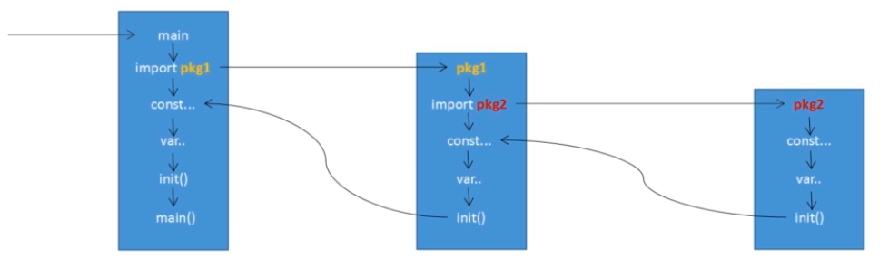
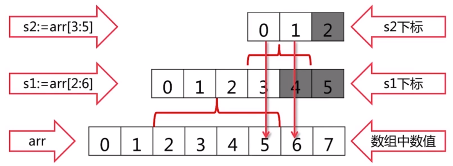
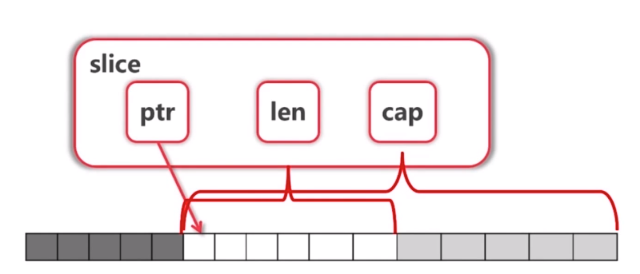
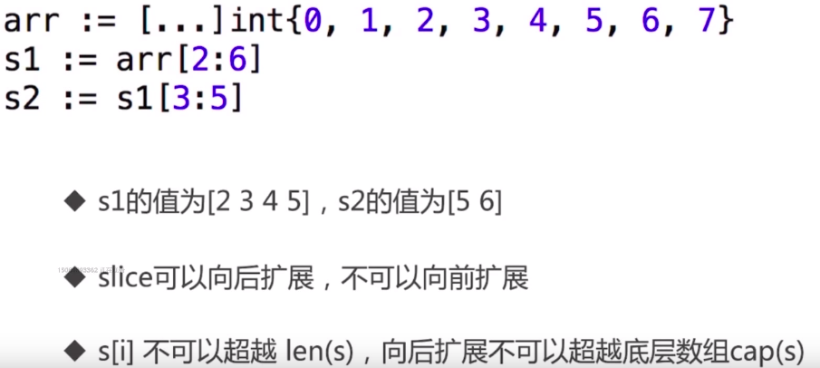

# Golang-Study
Golang Study
### gob
``` 
vim /etc/profile
export GOROOT=/opt/go
export PATH=$PATH:$GOROOT/bin
export GOPATH=$HOME/goproject
```
### hello golang
``` 
package main

import "fmt"

func main(){
    fmt.Print("Helo Golang!")
}
```
go run hello.go 编译并运行

### $GOPATH 约定三个子目录
- src 存放源代码(.go .c .h .s)
- pkg 编译后生成的文件 (.a)
- bin 编译后生成的可执行文件
``` 
go get github.com/beego/bee  #网站/开发者/package
$GOPATH/src/github.com/beego/bee
```

### Basics
- 特色 select go chan
- 基础结构
``` 
import "main" //程序所属包
import "fmt" //导入依赖包
const MANE string = "dollarkiller" //const常量
var age = 20 //全局变量

//一般类型声明
type ageInt int
//结构体声明
type Dollar struct {
}
//声明接口
type IDollar interface {
}
//函数定义
func Dor() {
    fmt.Print("DollarKiller")
}
//main()入口函数
func main() {
    Dor()
    fmt.Println("GOLANG")
}

```
- package
``` 
    package <pkgName>
    package main
    >>>
    main.main()函数独立程序入口点
    生成go可执行文件,必须要有main的package,且下必须要有main()函数
    同一个路径下只能存在一个package,一个package可以拆分成多个源文件
```
- import
>在 Go 中，首字母大写的名称是被导出的。
``` 
import 只能导入有package的包
不能导入源文件没有用到的包,否则会报错
语法格式1:
import "package1"
import "package2"
语法格式2:
import (
    "package1"
    "package2"
    ...
)
```
    - import 原理
    ```
    1.如果一个main导入其他的包，包将被顺序导入；
    2.如果导入的包中依赖其他包(包B),会首先导入包B,然后初始化B包中的常量变量,最后执行B包中的init()
    3.所有包导入完成后才会对main中的常量和变量进行初始化,然后指向main中的init函数(如何存在),最后执行main函数
    4.如果一个包被导入多次这该包只会被导入一次 
    ```
    
- var 定义 var varName type 蛤,和es5好像  定义了不用也会报错
``` 
func main(){
	var x int
	x = 1
	y,z := "DollarKiller","golang" //无法用于函数外部
	fmt.Printf("%d,%s,%s",x,y,z)
}
```
- const 常量
- int8 int16 int32 int64
- byte
- uint8 uint16 uint32 uint64 unsigned 无符号
- float32 float64
- complex 复数
- string
- array元组(静态) slice列表(动态)
- map hash字典
>任何数据类型以value形式输出fmt.Printf("%v",x)
- import
    - 别名 `别名 "fmt"`
    - 省略调用 `. "fmt"` 就可以直接用fmt的方法了 `[不建议]`
    - 只执行导入包的init方法 `_ "fmt"`
``` 
package main

import (
    别名 "fmt"
    .    "fmt"
    _    "fmt"
)
``` 
- 可见性规则
> GO语言中,使用大小写来决定 常量,变量,类型,接口,结构 或函数是否可以被外部所调用
- 函数名首字母 小写 即为provate
- 首字母大写 为public
>类型和变量
- 常量的定义
``` 
const (
    PI = 3.14
    const1 = "1"
)
```
- 变量的定义
    - 可以放在函数内,或直接放在包内 golang没有全局变量的概念
    - := 写的短一点
``` 
var (
    name = "dolalrkiller"
    age = 20
)
```
- 一般类型声明
``` 
type (
    newType int
    type1 fload32
)
```
- 基础类型
``` 
bool 长度1 只有true false  0 1不能表示
```
- iota 自增值
``` 
func enums() {
    const {
        cpp=inta
        java
        _
        python
        php
        golang
    }
    fmt.Println(cpp,java,python,php,golang)
    >为0 1  3 4 5 注释_是跳过
}
```
- `>> <<` 左移运算符"<<“是双目运算符。左移n位就是乘以2的n次方。 右移运算符">>“是双目运算符。右移n位就是除以2的n次方。
>条件语句
- if  if里面的变量具有作用域 外面要被调用必须return
``` 
package main
func bounded (v int) int {
    if v>100{
        return 100
    } else if v<0 {
        return 0
    } else {
        return v
    }
}

import (
	"fmt"
	"io/ioutil"
)

func main() {
	const filename = "abc.txt"
	contents,err := ioutil.ReadFile(filename)
	if err !=nil {
		fmt.Print(err)
	} else {
		fmt.Printf("%s\n",contents)
	}
}
``` 
- if奇淫技巧
```
if contents,err := ioutil.ReadFile(filename);err!=nil {
    fmt.Printf("%s\n",contents)
}else {
    fmt.Print(err)
}
```
- switch 会自动break
``` 
func eval(a,b int,op string) int {
	var result int
	switch op {
	case "+":
		result = a+b
	case "-":
		result = a-b
	case "*":
		result = a*b
	case "/":
		result = a/b
	default:
		panic("unsupported operator" + op)
	}
	return result
}
```
- switch pro  //panic终端服务指向 并且 报错
``` 
func grade(score int) string {
	g := ""
	switch {
	case score<0 || score>100:
		panic(fmt.Sprintf("Wrong score:%d",score))
	case score>80:
		g = "a"
	case score>60:
		g = "b"
	case score<60:
		g = "f"
	}
	return g
}
```
- for
``` 
func converToBin(n int){
	for s :=0 ;s<n;s++{
		fmt.Println(s)
	}
}
```
- while 没有了哈哈
``` 
for 判断 {
    内容
}

for  {
    死循环
}
```
- 函数 (函数可以作为参数 没有默认参数,可选参数)
``` 
func funcName(x,y int) (x,y int) {
    return 
}

func funcName(x,y int) (int,int) {
    return x,y
}

func sum(number ...int) int {
    s := 0
    for i := range number {
        s += number[i]
    }
}

func sun (op func(int,int) int,a,b int) int {
    
    return op(a,b)
}
```
> 传入函数
```
func apply(函数名称 函数体 返回类型,..) {
    
}

func apply(op func(int.int) int,a,b,int) int {
    return op(a,b)
}
```
> 指针 
``` 
var a int = 2
var pa *int = &a
*pa = 3
fmt.Println(a)

指针不能运算
```
> 数组,切片,容器
- 数组
``` 
func main() {
	var arr1 [5]int // 初始值0
	arr2 := [3]int{1,3,5} // :=必先初始化
	arr3 := [...]int{2,4,6,8,10} // 定义切片
	var grid [4][5]int // 定义四行五列

	fmt.Print(arr1,arr2,arr3,grid)
}
```
- 数组遍历
``` 
    for i := 0; i<len(arr3);i++  {
		fmt.Print(arr3[i]," ")
	}

	for k,v := range arr3 { // 下标 value  if 只有k就只要下标
		fmt.Println("key: ",k,"value: ",v)
	}

	for _,v := range arr3 {
		fmt.Print(v)
	}
```
> 注意
``` 
[10]int [20]int是不同类型
调用func f(arr [10]int) 是值传递
```
- Slice切片 实现机制视图
``` 
arr := [...]int{0,1,2,3,4,5,6,7,8,9}
s := arr[2:6] // 前闭后开
```
> 切片是引用传递
> Slice本身没有数据,是对应底层array的一个view
``` 
func updateSlice(s []int) {
	s[0] = 110
}

func main()  {
	arr := [...]int{0,1,2,3,4,5,6,7,8,9}
	a := arr[2:6]
	b := arr[2:] // 从2去到最后
	c := arr[:6] //  从头开始取6个
	d := arr[:] // 全部
	fmt.Println(a)
	fmt.Println(b)
	fmt.Println(c)
	fmt.Println(d)
}
```

``` 
func mm() {
	s := [10]int{0,1,2,3,4,5,6,7,8,9}
	s1 := s[2:6] // 2,3,4,5
	s2 := s1[4:6] // 6,7
	fmt.Println(s2)
}
```



`fmt.Printf("arr= %v len(arr)= %d cap(arr)=%d",a,len(a),cap(a));`
    - 添加元素 `append(s2,10)` 在最后加入
        - append if超越cap系统会分配更大的底层数组 原来的数组没有用就会被回收掉
    - 指定len cap
    `s3 := make([]int,len,cap)`
    ``` 
    s2 := make([]int,16,20)
    fmt.Println("value" , s2 , len(s2), cap(s2))
    ```
    - copy
        - `copy(拷贝到,拷贝的内容)` 例如copy(s2,s1) 把s1 copy到s2最前面
    - 删除
        - 删除指定元素
            - `s2 = append(s2[:3],s2[4:]...)`
### Map 无序
- 定义
``` 
func main()  {
	m := map[string]string {
		"name": "dollarkiller",
		"age": "18",
		"course": "golang",
	}
	fmt.Print(m)
}
```
> 注释 用没有定义的返回 空
``` 
    if cases,ok := m["case"];ok {
        fmt.Println(cases)
    }else {
        fmt.Printlb("key is not exist")
    }
	fmt.Println(cases,ok)
    // ok 存在返回true 反之else
```
- 删除 `delete(map,key)`
``` 
    if name,ok := m["name"];ok {
        delete(m,"name)
    }
```
> 注释 定义 := if 定力了用更改等操作用=
- 小结
    - 创建 `make(map[string]int)`
    - 获取元素 `m[key]`
    - 当key 不存在时,获得value类型的初始值
    - 用 `value,ok := m[key]` 用ok判断是否存在
    - `delete(m,key)`
    - 遍历 `k,v := range map`
        - 不保证便利顺序 需要手动对key排序
        - 使用len获得元素个数
- map的key
    - map使用hash表,必须可以比较相等
    - 除了slice,map,func的内建类型都可以作为key
    - struct类型不包含上述字段,也可以作为key
    
### golang指南

#### 基础
- 多值返回
``` 
package main

import "fmt"

func swap(s,y string) (string,string) {
	return s,y
}
//函数可以返回任意数量的返回值
func main() {
	a,b :=swap("hello","golang")
	fmt.Println(a,b)
}
```
- 命名返回值
``` 
package main

import "fmt"

func split(sum int) (x,y int) {
	x = sum * 4 / 9
	y = sum -x
	return 
}
//命名返回值  golang返回值可以命名 没有参数的return 返回结果当前值`


func main() {
	fmt.Println(split(17))
}
```
- 变量var  bool默认值 false 0
``` 
package main

import "fmt"

var cpp, python,php,java bool
//定义在func外面为全局变量
func main() {
	var i int
	//定义在func内为局部变量 
	fmt.Println(i,cpp,python,php,java)
}

```
- `:=` 简洁赋值语句
``` 
package main

import "fmt"

func main() {
	var i,j int = 1, 2
	c,python,java,php := true,true,false,"ok!"
	//在函数中可以使用 `:=` 简洁赋值语句在明确类型的地方可以用于替代var定义  BUT在函数体外必须以关键字开始 `:=`不能用于函数体外
	fmt.Println(i,j,c,python,java,php)
}

```
- 基础类型
> golang占位符 https://studygolang.com/articles/2644
``` 
package main
  
import (
        "fmt"
        "math/cmplx"
)

var (
        ToBe bool = false
        MaxInt uint64 = 1<<64-1
        z complex128 = cmplx.Sqrt(-5 + 12i)
)

func main() {
        const f = "%T(%v)\n"
        fmt.Printf(f,ToBe,ToBe)
        fmt.Printf(f,MaxInt,MaxInt)
        fmt.Printf(f,z,z)
}
// 别名 byte//uint8  rune //int32 代表一个Unicode码

//变量的定义可以打包在一个语法块中:
```
- 零值
> 变量在定义时没有明确的初始化时会赋值为零值
> 数组类为0 布尔类为false 字符串类为"" 空字符串
- 类型转换
``` 
var i int = 24
var f float64 = float64(i)
var u uint = uint(float64)
```


